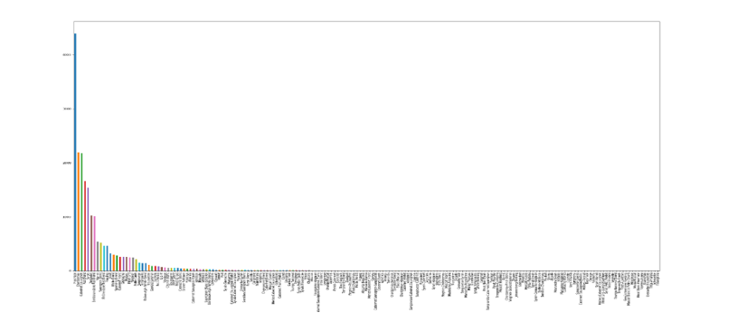
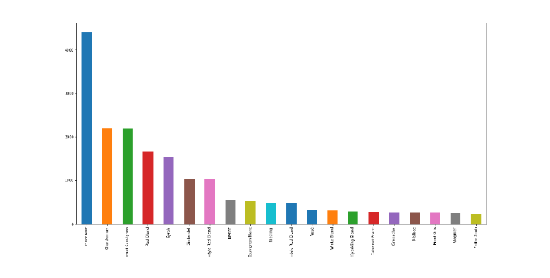
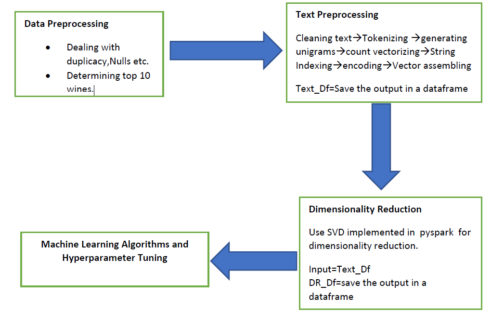
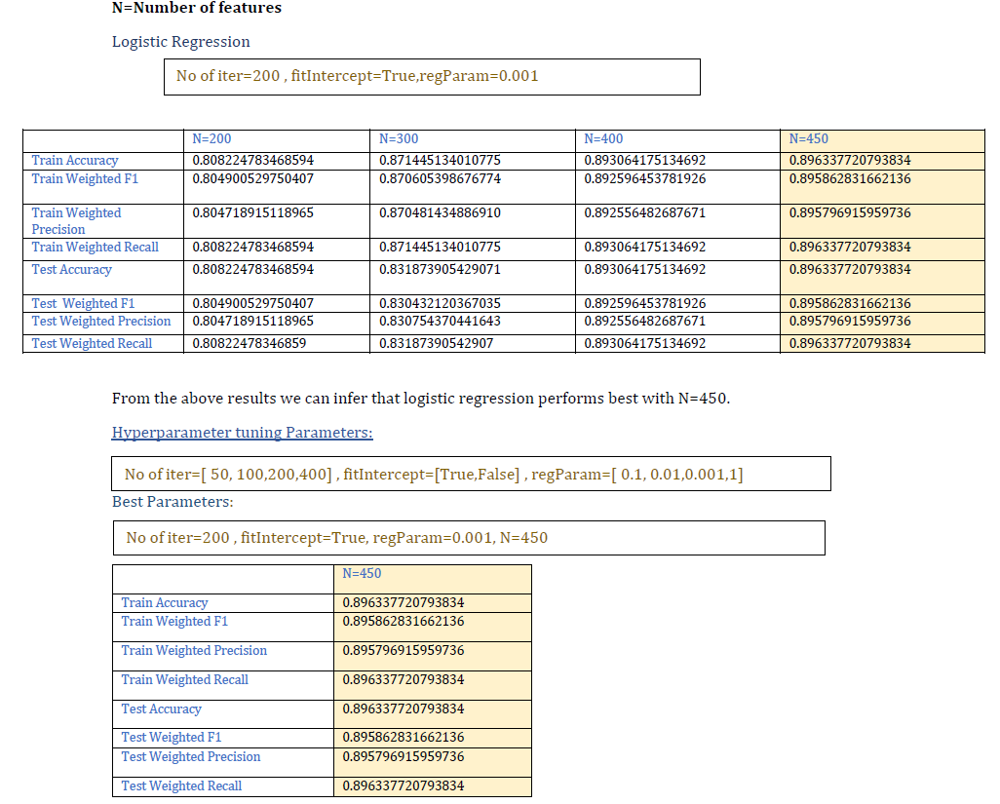
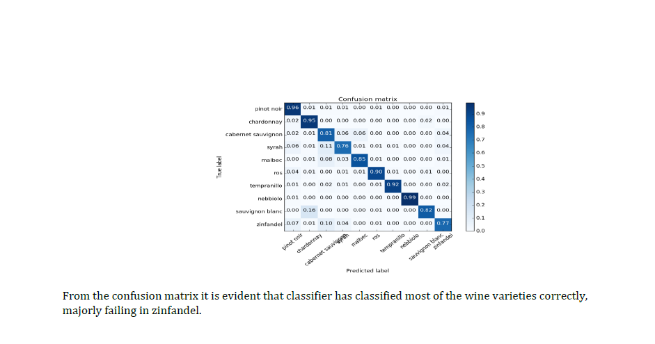
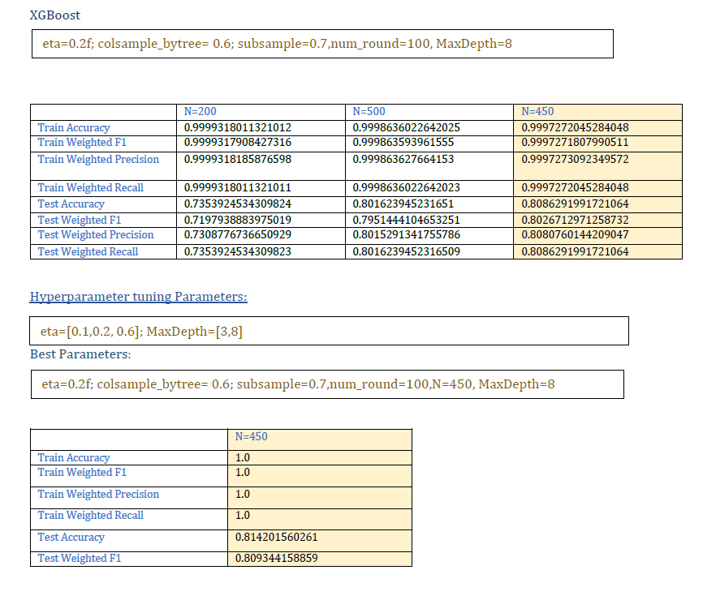
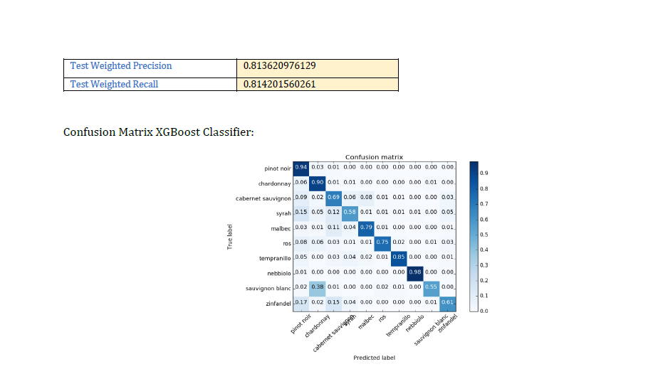
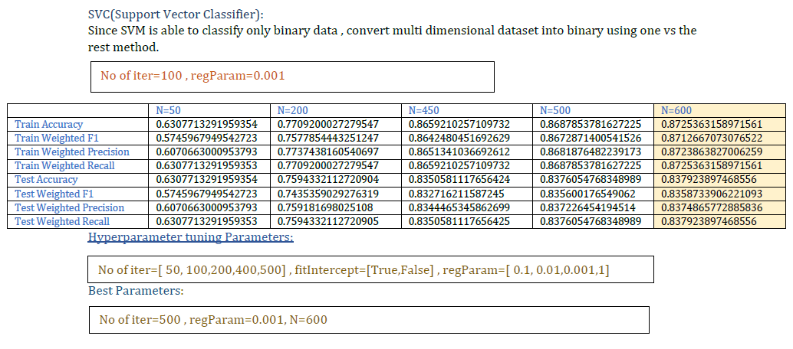
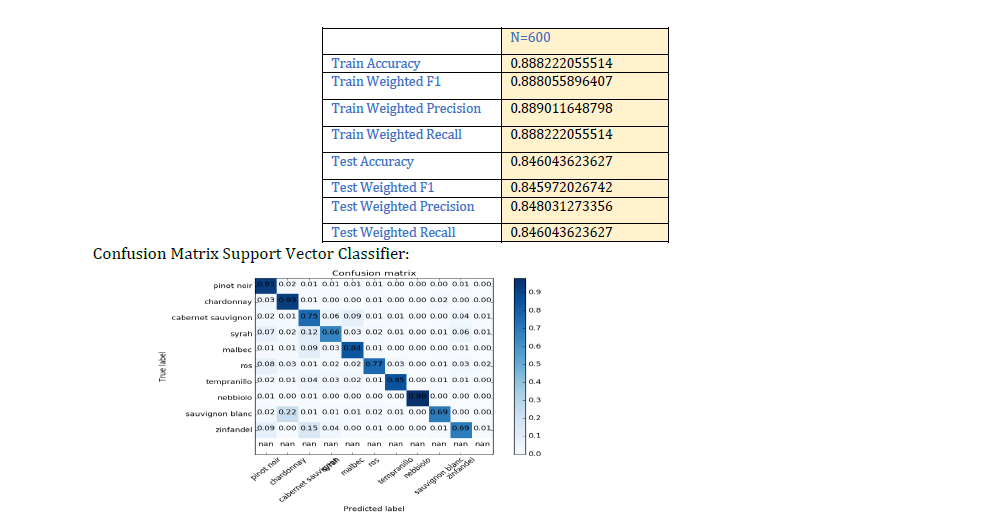
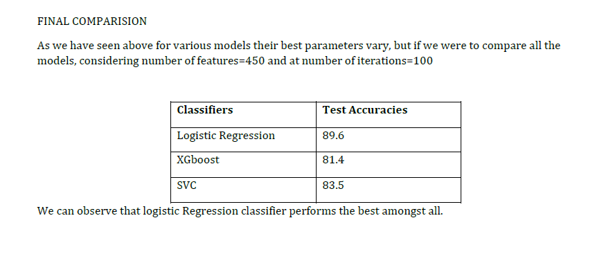

# Prediction of Wine Variety using NLP

## INTRODUCTION

## Natural language Processing
Natural language processing is branch of artificial intelligence that helps computers understand, interpret and manipulate human language. It aims to fill the gap between human communication and computer understanding.
NLP makes it possible for computers to read text, hear speech, interpret it ,measure sentiment and determine which parts are important. Infact, we extensively use NLP in our daily life, spell checker, autocomplete, voice text messaging, spam filters, related key word search engines, Siri, Alexa, Google assistant etc. are all a result of NLP.

## Objective of the project
NLP deals with a huge amount of structured/unstructured data for analysis, so the objective of this project is to predict the variety of the wine by the application of NLP on a Big Data platform. A structured dataset and Databricks Big Data platform is used for this project.
Here we work with 35 different varieties with 300k samples. Data cleaning, preprocessing, various NLP techniques and machine learning classification are the methods that are explored in this project for achieving the desired goal.
Hyperparameter tuning is implemented to achieve the best performing parameters for the selected machine learning classification models.

## Environments Used
        1.	Scala On Databricks, Cluster size:14GB,4Cores
        2.	Pyspark On Databricks, Cluster size:14GB,4Cores
        3.	Python On Databricks, Cluster size:14GB,4Cores

## History of dataset
About the dataset
The dataset is the Kaggle Wine review dataset which was scraped from Wine Enthusiast during the week of June 15th, 2017. This dataset offers some great opportunities for sentiment analysis and other text related predictive models.
It has 130k rows and 13 columns.
Columns
        1.	Country: The country that the wine is from.
        2.	Description: The description of the wine.
        3.	Designation: The vineyard within the winery where the grapes that made the wine are from.
        4.	Points: The number of points Wine Enthusiast rated the wine on a scale of 1-100 (though they say they only post reviews for wines that score >=80).
        5.	Price: The cost for a bottle of the wine.
        6.	Province: The province or state that the wine is from.
        7.	Region_1: The wine growing area in a province or state (i.e. Napa)
        8.	Region_2: Sometimes there are more specific regions specified within a wine growing area (i.e. . Rutherford inside the Napa Valley, these can be blank values)
        9.	Taster Name
        10.	Taster Twitter Handle
        11.	Title: The title of the wine review, which often contains the vintage.
        12.	Variety: The type of grapes used to make the wine (i.e. Pinot Noir).
        13.	Winery: The winery that made the wine.

## DATA EXPLORATION
Importing Data
We import the data into a spark data frame for natural language processing , plotting and machine learning. We observed that region_2 had a lot of null values so we discarded region_2 and designation column.
We use country, description, price, points,province,region_1,variety and title for our analysis.

## Data Preprocessing
        1.	Columns with high percentage of Null values
        2.	Rows with null values
        3.	Rows with duplicate values
        4.	Rows with duplicate values of description and variety in combination
        5.  Bring variety names on a common ground, since different countries have different names for the same grape.Eg. replacing German names with English names of wines:
                "weissburgunder"--> "Chardonnay"
                "spatburgunder" --> "pinot noir"
                "grauburgunder" --> "pinot gris"
                
  
 
Evidently there is an imbalance in the dataset,so top 10 varieties were choosen for our analysis. So, finally we are left with a dataset with  20944 rows where we split the dataset into 7:3 ratio i.e. trainDataset size=14663 and test Dataset size=6281.
 
 
 

## Text Preprocessing
Cleaning Text
Before we proceed to NLP techniques the dataset must be cleaned thoroughly to get rid of any discrepancies.
The following steps were executed:
        1.	Lowercase all the columns.
        2.	Remove special characters(@,%,”,$,(,),?).
        3.	Remove trailing and leading spaces and in-word spaces. 
        4.	Remove numeric values.
Feature Transformers
        1.	Tokenization
        2.	Stop Words Remover
        3.	N-Gram
        4.	Lemmatization: Determining the root word of the word. e.g. running-run.
        5.	Stemming: Removing suffixes. Eg.running-runn.
        6.	Vector Assembler
        7.	OneHotEncoder
        8.	StandardScaler
Stemming and Lemmatization are one of the most powerful tools in the Natural Language processing Library it’s not necessarily they increase the performance of our model. In our case these techniques reduced the accuracy of our model, so we stick to the traditional method of feature transformers.
Hence, the input should not be stemmed or lemmatized.

## Feature Extractors
        1.	TF-IDF
        2.	Word2Vec
        3.	Count Vectorizer
For our model, TF-IDF and Word2Vec gave 76% accuracy while Count Vectorizer performed with 83% accuracy. 
The possible explanation to this could be :
 There is substantial research that shows that use of some function words (e.g. first-person singular pronouns, “I”) change depending on someone’s psychological state. Function words like pronouns are very common and would be down weighted in tf-idf, but given equal weight to rare words in count vectorizer. 

## DIMENSIONALITY REDUCTION
        1.	PCA(Principal Component Analysis)
        2.	Singular Value Decomposition(SVD):The singular value decomposition(SVD) is a factorization of a real or complex matrix. It is the generalization of the eigen decomposition of a positive semidefinite normal matrix (for example, a symmetric matrix with positive eigenvalues) to any matrix via an extension of the popular decomposition.
As our cluster has limited resources, we encountered “java heap space “ issue every time we tried to execute PCA in scala. Hence, we developed the code in python(on databricks) for SVD and used the data frame obtained after feature transformer step in the SVD for dimensionality reduction.

## MODEL SELECTION
The major problem statements that must be satisfied by the model are:
        1.	It is a supervised learning scenario.
        2.	The objective directs towards a classification problem.
        3.	The model must be able to deal with multiclass classification.
        4.	The model must be able to handle imbalanced dataset.
        5.	The model must be able to deal  well with noise.
Based on the above stated requirements the following three classifiers were choosen:
### Logistic Regression Classifier(Used as our benchmark model):
        •	Logistic regression can easily be generalized to multiple classes.
        •	It maximizes the likelihood of accuracy.
        •	It is good in dealing with sparse vectors.
### Support Vector Machine Classifier:
        •	SVC works by maximizing the distance between the margin and points .
        •	SVM optimization works on the norm of the vectors and not on the dimensions directly.
        •	Works well for text classification since it has sparse vectors  Kernel trick: kernel is a way of computing dot product of two vectors x and y in some very high  dimensional space , generalized dot product effective in higher dimension .
        •	 SVC is effective when the number of features are more than training examples  larger time to process for larger dataset.
### XGBoost Classifier:
        •	Boosting, trees are built sequentially such that each subsequent  XGBoost is scalable,.
        •	It drives faster learning through parallel and distributed computing and offers efficient memory usage subsample between 0 to 1.
        •	Handles noise well that occurs due to higher dimensions.
        •	Work well with low-quality features.

## METRICS
Objectives for selecting the right metrics:
        •	We are dealing with an imbalance dataset
        •	We are dealing with multiclass classification
Hence Macro average is preferable  to evaluate our models considering the above two conditions:
        1.	Accuracy: Number of items correctly identified as either truly positive or truly negative out of the total number of items.
        2.	Weighted Precision: Averaged Number of items correctly identified as positive out of the total items identified as positive.
        3.	Weighted Recall: Averaged Number of items correctly identified as positive out of the total actual positives.
        4.	Weighted F1: The harmonic average of the precision and recall, it measures the effectiveness of identification when just as much importance is given to recall as to precision .

## FLOW DIAGRAM
 

## HYPERPARAMETER TUNING
For tuning our models we used Cross-Validation technique.
Cross-Validation: CrossValidator begins by splitting the dataset into a set of folds which are used as separate training and test datasets. To evaluate a particular ParamMap, CrossValidator computes the average evaluation metric for the 3 Models produced by fitting the Estimator on the 3 different (training, test) dataset pairs provided number of folds=3.

## RESULTS

 
 
 
 
 
 
 
 
 
 
 
 
 

 

